# kou-skills

KOUのコアメンバー向け **AIスキル集（全22本）** です。**URLを1本登録するだけ**で、claude.ai・Claude Desktop・Claude Code のどこからでも使えます。

```
https://kou-skills-mcp.tomosuke-chiba-work.workers.dev/mcp
```

| 分類 | 内容 |
|---|---|
| 思考・設計系（12本） | 認識合わせ→完了定義→解決策探索、案件フロー図、KOU青系スライド制作のスキル |
| 動画編集系（10本） | 文字起こし→カット→字幕→整音→横インタビュー／縦リール焼き込み（詳細は [plugins/fulltelop-edit/README.md](plugins/fulltelop-edit/README.md)） |

> このリポは public です。招待も認証設定も不要で、誰でもそのまま接続できます。
> 旧リポ名 `kou-claude-plugins` から改名しました（旧URLは自動リダイレクトされます）。

---

## 🗺 全体構成

### 配布のしくみ

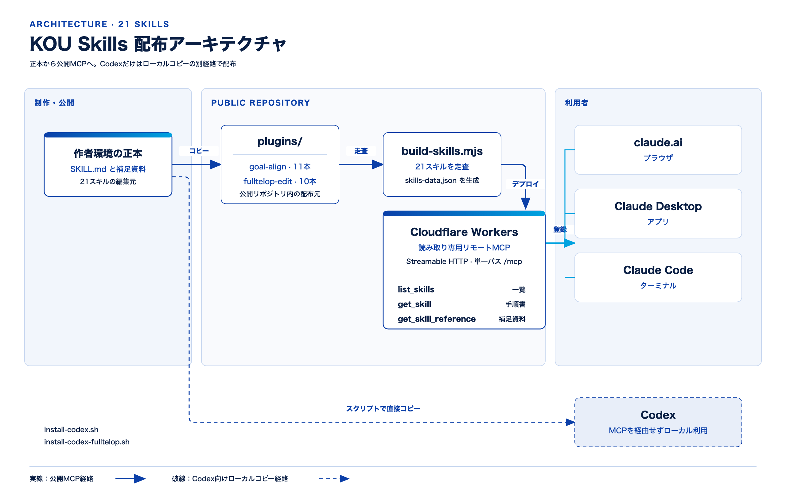

スキルの正本をリポジトリにコピーし、22本を1つにまとめてCloudflare Workersへデプロイしています。利用者はURLを1本登録するだけで、claude.ai・Claude Desktop・Claude Code のどこからでも同じ22本を引けます（Codexだけはローカルコピーの別経路）。

### 22スキルの全体マップ

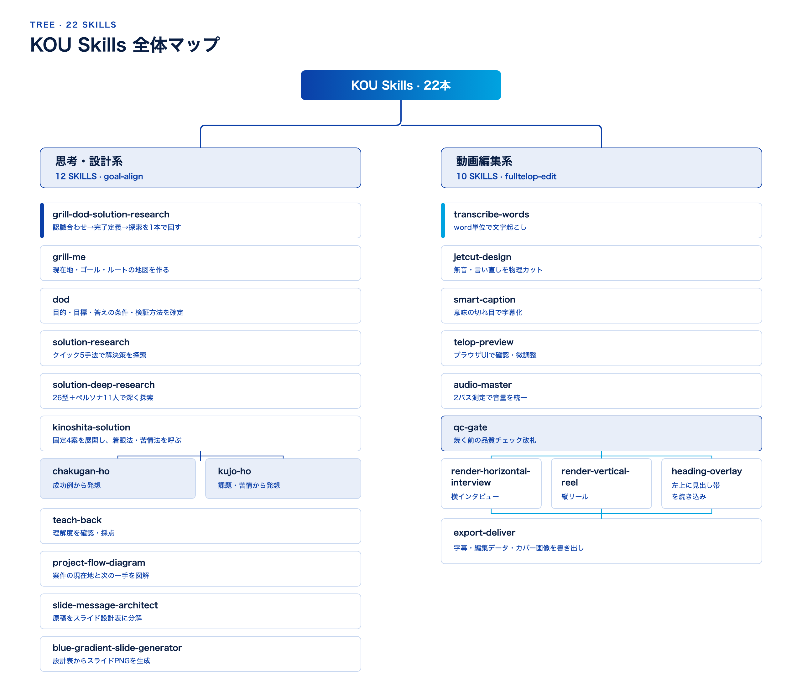

> 図は [`docs/diagrams/`](docs/diagrams/) に単体HTMLでも置いてあります（ブラウザで開くと拡大して見られます）。

---

## 📦 つなぎ方（所要1分）

登録するURLは全クライアント共通でこれ1本です。

```
https://kou-skills-mcp.tomosuke-chiba-work.workers.dev/mcp
```

### A. claude.ai（ブラウザ）の人

1. 右上のプロフィール → **設定（Settings）** → **コネクタ（Connectors）** を開く
2. **「カスタムコネクタを追加」** をクリック
3. 名前に `kou-skills`、URLに上のアドレスを貼って追加

認証（ログイン）は不要です。追加後、チャットで「使えるスキルを一覧して」と言えば22本が出ます。

### B. Claude Desktop（アプリ）の人

claude.ai と同じアカウント設定を共有しています。**A の手順をブラウザで1回やれば、アプリ側にも反映されます**（反映されないときはアプリを再起動）。

### C. Claude Code（ターミナル）の人

```bash
claude mcp add --transport http kou-skills https://kou-skills-mcp.tomosuke-chiba-work.workers.dev/mcp
```

`/mcp` コマンドで `kou-skills` が connected になっていれば成功です。
Claude Code では各スキルが `/mcp__kou-skills__<スキル名>` というスラッシュコマンドとしても出ます。

### 使い方（共通）

つないだ後は、次の3つの道具が使えます。

| 道具 | 何をするか |
|---|---|
| `list_skills` | 22スキルの一覧と説明を出す（「どんなスキルがある？」で呼ばれます） |
| `get_skill` | 指定したスキルの手順書を丸ごと読み込む（「dodスキルで完了定義を作って」等） |
| `get_skill_reference` | そのスキルの補足資料を読み込む |

> ⚠️ 動画編集系の10本は、**手順書は読めますが実行には各自のローカル環境（ffmpeg / Python / Whisper）が必要**です → [インストール要件](plugins/fulltelop-edit/docs/install-requirements.md)

---

## 🖥 Codex の人（ローカルインストール）

Codex は同じ SKILL.md 形式に対応しています（配置先が違うだけ）。ターミナルで:

```bash
git clone https://github.com/tomosuke-chiba/kou-skills.git
bash kou-skills/install-codex.sh
```

スクリプトが12スキルを `~/.agents/skills`（Codex公式の置き場）へコピーし、`~/.codex/skills` がある環境にはシムリンクも張ります。既存の同名スキルは上書きしません。

動画編集パック fulltelop-edit を Codex で使う場合は、こちらを実行します（フォント等のアセットも `~/.agents/assets` へ配置します）:

```bash
bash kou-skills/install-codex-fulltelop.sh
```

ターミナルを使いたくない場合は、次のプロンプトを Codex にそのまま貼ってもOKです:

```
https://github.com/tomosuke-chiba/kou-skills を一時ディレクトリに git clone し、
同梱の install-codex.sh の内容を確認してから実行して、結果を報告してください。
```

導入後は新しい Codex セッションで `$grill-dod-solution-research` と入力（または自動発動）で使えます。
Codex には Claude Code の「Skillツール」が無いため、スキル間の連携は「同梱スキルの SKILL.md を直接読み込む」方式で動きます（grill-dod-solution-research 内に読み替えルールを記載済み）。

---

## ⚠️ 以前プラグインで入れた人へ（MCPに一本化しました）

配布方法を **プラグイン → MCPコネクタ** に一本化しました。URL1本で全クライアントに配れるためです。

**やること**: 上の「つなぎ方」でMCPを登録してください。それだけで22本すべて使えます。

**古いプラグインの掃除**（任意・入れっぱなしでも壊れません）:

```
/plugin uninstall goal-align@kou-skills
/plugin uninstall fulltelop-edit@kou-skills
```

（さらに古い `@kou-plugins` 版を入れていた人は、名前を `kou-plugins` に読み替えて同じコマンドを実行）

**Codex** はローカルコピー方式のままです。作業は不要ですが、クローン済みリポを更新に使う場合だけリモートURLを新名称にしておくと確実です:

```bash
git -C kou-claude-plugins remote set-url origin https://github.com/tomosuke-chiba/kou-skills.git
```

---

## 🧰 思考・設計系スキル（12本）

### 🧭 オーケストレータ

#### grill-dod-solution-research

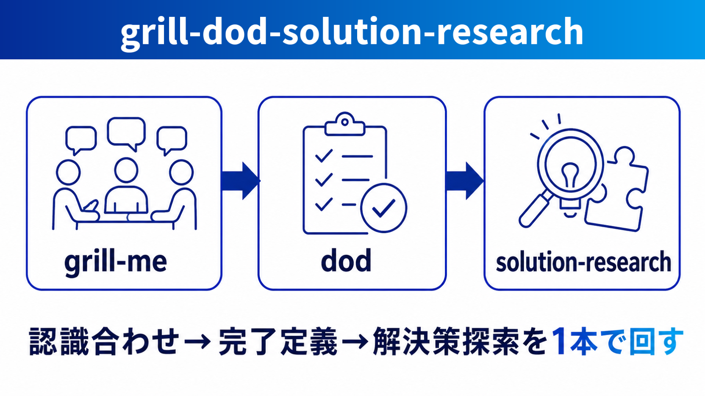

認識合わせ（grill-me）→完了定義（dod）→解決策探索（solution-research）を**1本で回す**オーケストレータです（旧名 `align-dod-solve`）。「認識ズレてる気がするから最初から詰めて」のような曖昧な依頼でも、要件のズレを構造化して止めます。grill-me で作った共通認識の地図を、重複質問なしで dod の4要素に自動変換します。

> こんなとき: 「壁打ちから完了定義まで固めて」「要件定義から解決策まで一気に」

### 🤝 認識合わせ・理解確認

#### grill-me

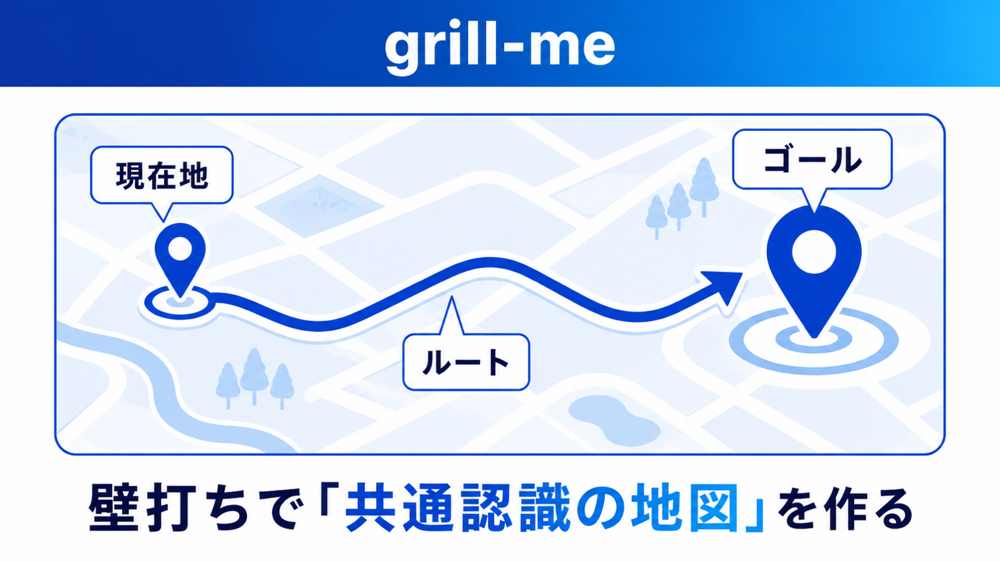

Googleマップ型の壁打ちで、現在地・定量ゴール・ルート選択基準・進捗指標・期限・前提制約を対話から揃え、**共通認識の地図**を1ファイルに固定します。

> こんなとき: 「壁打ちして」「認識合わせしたい」「この計画、詰めが甘い気がする」

#### teach-back

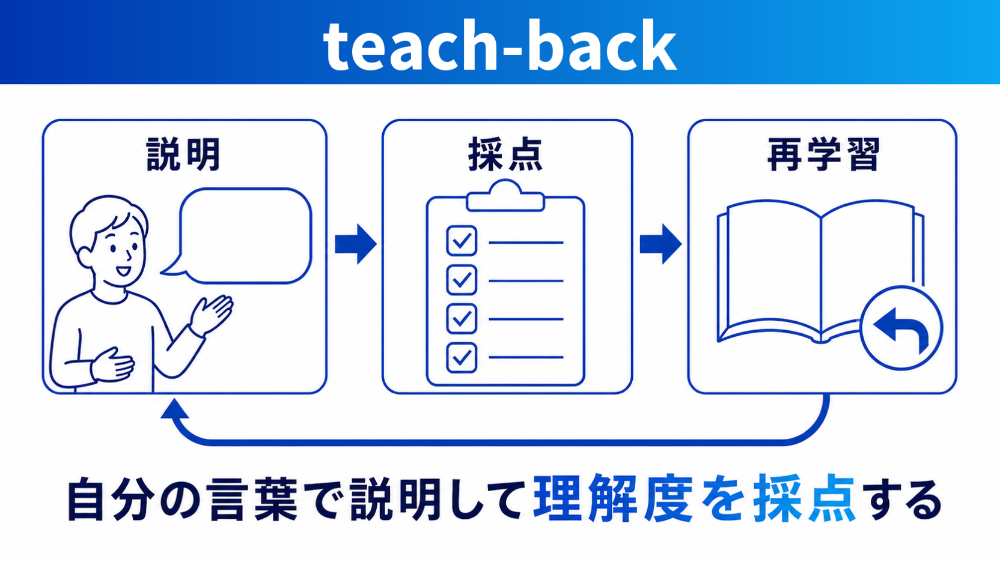

計画・設計・重要な依頼を**自分の言葉で説明**してもらい、目的・構造・判断・リスク・検証・復旧の理解を採点して、足りない部分だけ再学習します。実装や公開の前の「理解ゲート」です。

> こんなとき: 「要するにこうで合ってる？」「理解確認してから進めたい」

### 🗺 進捗可視化

#### project-flow-diagram

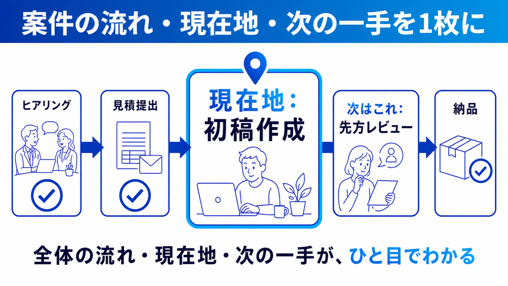

進行中の案件を、**全体の流れ・現在地・次の一手**がひと目で分かるフローチャートにします。完了・進行中・未着手・相手待ち・分岐を区別し、不明点は推測せず「？」のまま残します。状況が動いた後は、同じ構成の更新版を出せます。

> こんなとき: 「案件を図解にして」「進捗をフロー図にして」「図解を最新にして」

### 🎯 完了定義

#### dod

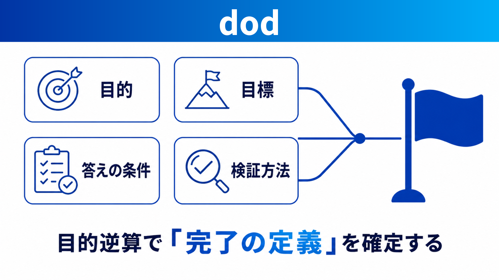

目的逆算思考（木下勝寿式）でタスクの**完了の定義（DoD）**を作ります。「目的→目標→答えの条件→検証方法」の4要素に分解し、「何をもって完了か」を曖昧さゼロにしてから着手できるようにします。

> こんなとき: 「DoDを決めて」「完了定義を作って」「このタスク、ゴールが曖昧」

### 💡 解決策探索

#### solution-research

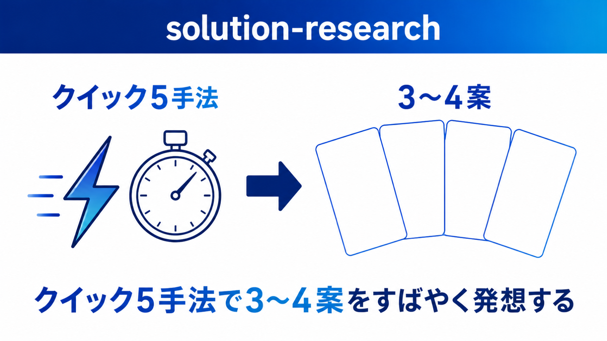

**軽量版**のソリューション探索。クイック5手法（着眼法・苦情法・最短合格ルート・理想逆算・逆転）から2〜3手法を選び、1応答で3〜4案＋推奨までサクッと出します。迷ったらまずこちら。

> こんなとき: 「解決策の候補を出して」「サクッと案がほしい」

#### solution-deep-research

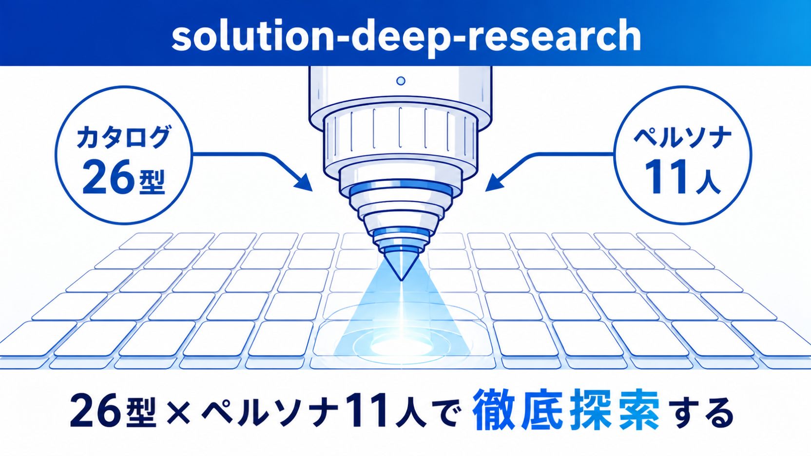

**重量版**のソリューション探索。コア10手法×6ベクトルに加え、カタログ26型＋経営者ペルソナ11人の視点で**徹底探索**し、最終目的から逆算して推奨を言い切ります。

> こんなとき: 「深く・徹底的に案を出して」「別の切り口も全部見たい」

#### kinoshita-solution

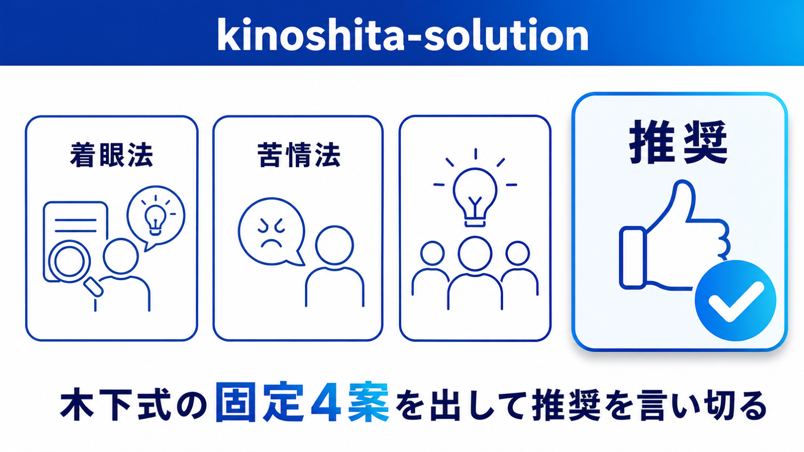

木下勝寿式の**固定4案**構成（着眼法×2案＋苦情法×2案）で解決策を出し、最終目的逆算で比較して推奨を言い切るパッケージです。単体起動もできます。

> こんなとき: 「木下式で4案出して」「固定フォーマットで比較したい」

#### chakugan-ho

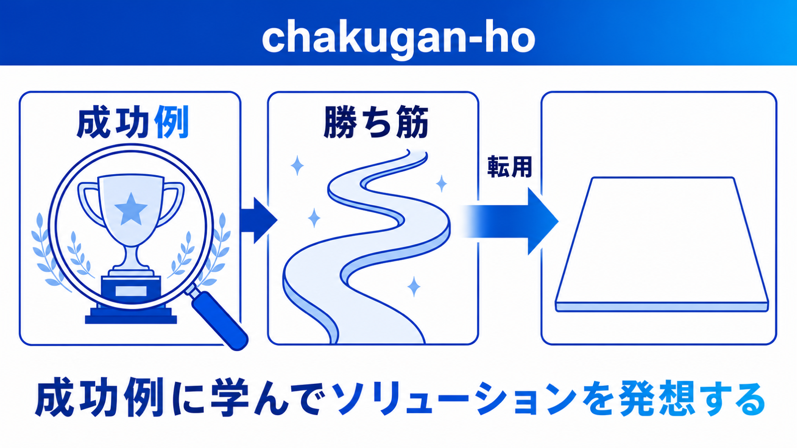

着眼法＝**成功例に学ぶ**発想法。同じ「答えの条件」を満たした成功例を探して勝ち筋の構造を抽出し、今回への転用案を出します。kinoshita-solution からも自動で呼ばれます。

> こんなとき: 「うまくいってる事例から考えて」「成功例を探して」

#### kujo-ho

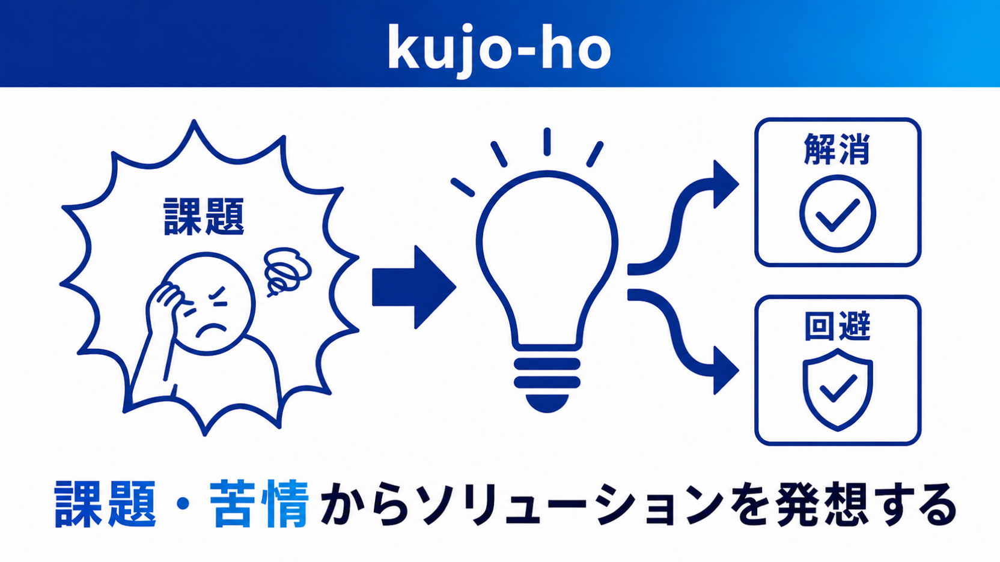

苦情法＝**課題・苦情から発想する**方法。達成を妨げる課題・不満・ボトルネックを洗い出し、その「解消」または「回避・不要化」を解決策に変換します。

> こんなとき: 「何がボトルネックか洗い出して」「課題起点で考えて」

### 🎨 スライド制作

#### slide-message-architect

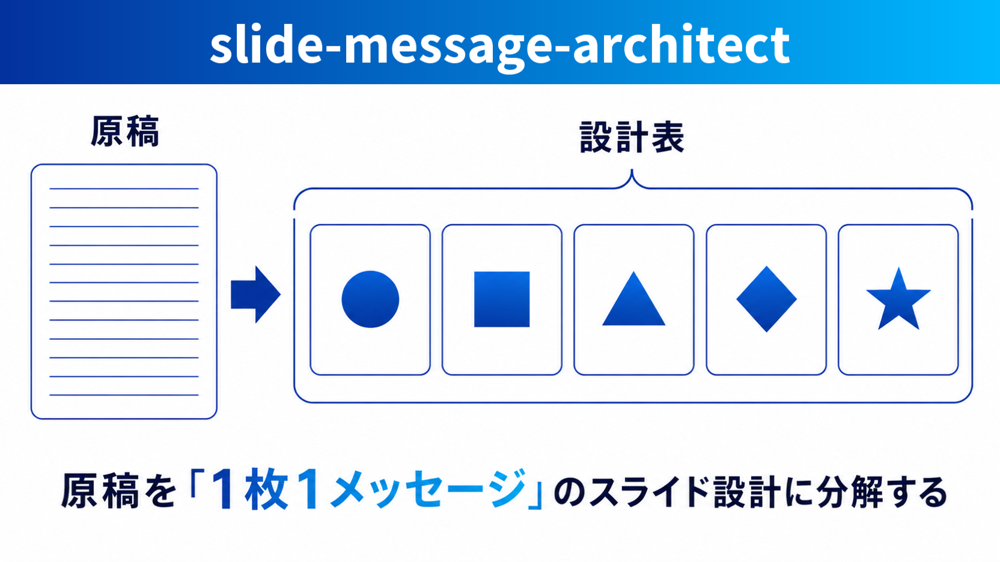

原稿・アウトラインを「**1枚1メッセージ**」のスライド設計表（枚数・結論・コピー台帳）に分解します。blue-gradient-slide-generator の前工程です。

> こんなとき: 「この原稿をスライド構成にして」「何枚に分ければいい？」

#### blue-gradient-slide-generator

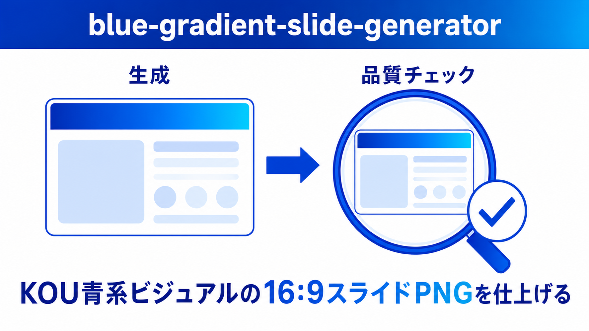

KOUのコバルト→シアン青系ビジュアルで **16:9スライドPNG** を生成し、品質チェックまで行います。生成エンジンは Codex 組み込みの image_gen（Claude Code から使うと生成部分を codex exec へ自動委譲）。このREADMEの画像もこのスキルで生成しています。

> こんなとき: 「セミナースライドをPNGで仕上げて」「この構成表を青系デザインで画像化して」

---

## 🎬 動画編集系スキル（10本）

素材の動画を渡すところから、字幕入りの完成動画を書き出すところまでを10本でつなぎます。工程順に並んでいるので、上から順に使えば1本の動画が仕上がります。

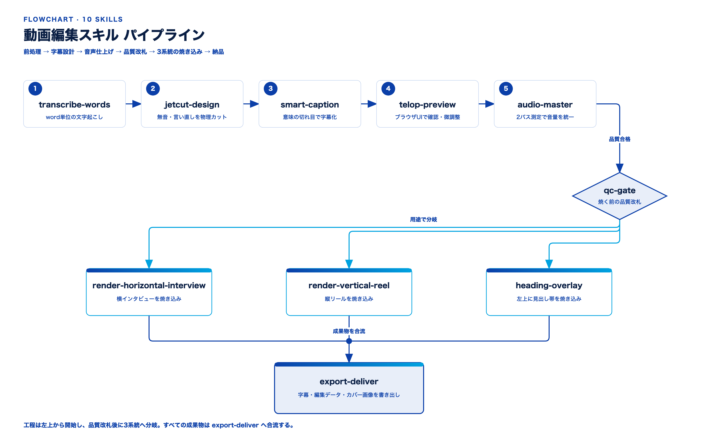

> ⚠️ このパックは**手順書だけでは動きません**。実行には手元の環境に ffmpeg / Python / Whisper が必要です → [インストール要件](plugins/fulltelop-edit/docs/install-requirements.md)

### 📝 前処理

#### transcribe-words

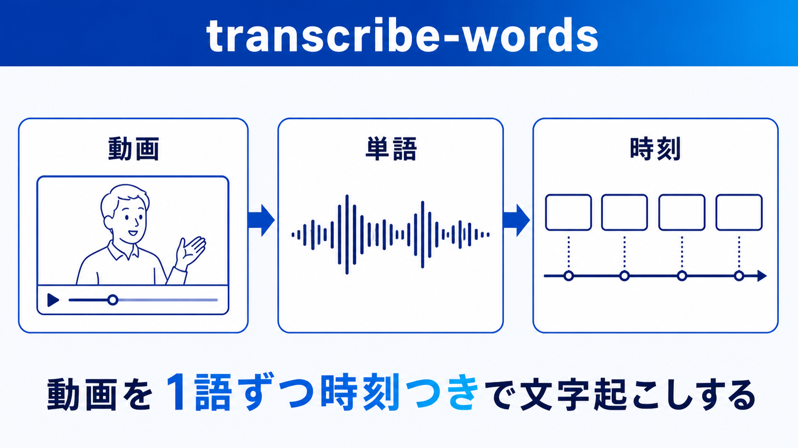

動画・音声を**単語1つずつに時刻をつけて**文字起こしします。この時刻が後工程すべての土台になります。Macは mlx_whisper、Windowsは faster-whisper に自動で切り替わります。

> こんなとき: 「この動画を文字起こしして」「編集用の元データを作って」

#### jetcut-design

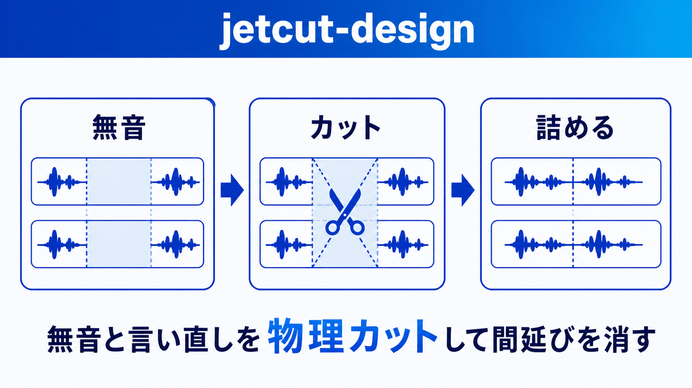

無音・フィラー（「えーと」等）・言い直しを**物理的に切って詰めます**。既定では1.0秒を超える無音を0.5秒の自然な間に縮めるので、間延びしない見やすい尺になります。

> こんなとき: 「テンポよくして」「無駄な間をカットして」

### 💬 字幕設計

#### smart-caption

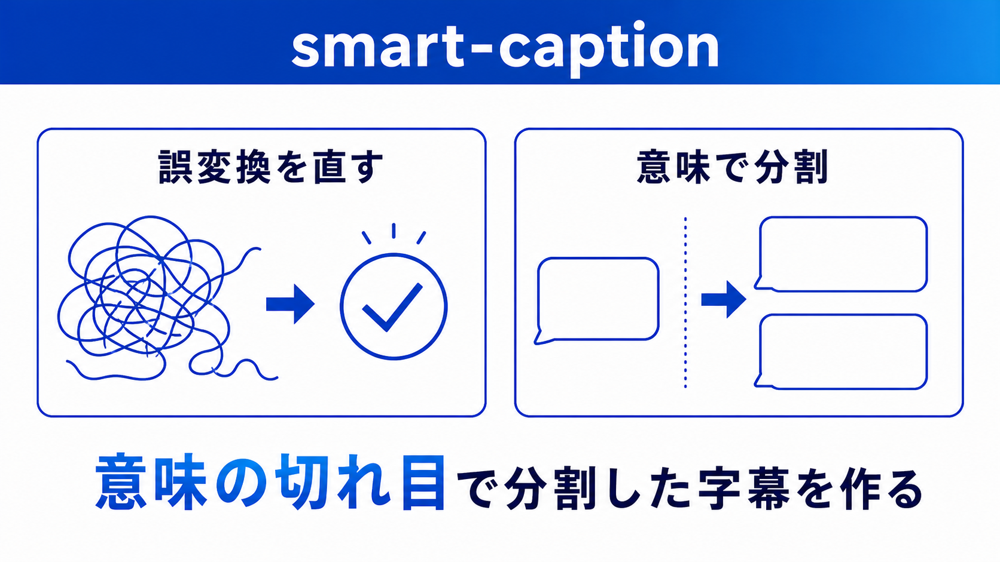

文字起こしから**意味の通る字幕**を作ります。文脈から誤変換を直し、17文字前後で意味の切れ目に分割し、各テロップを最初と最後の語の両方で時刻に固定するのでズレません。

> こんなとき: 「字幕を作って」「テロップを整えて」

#### telop-preview

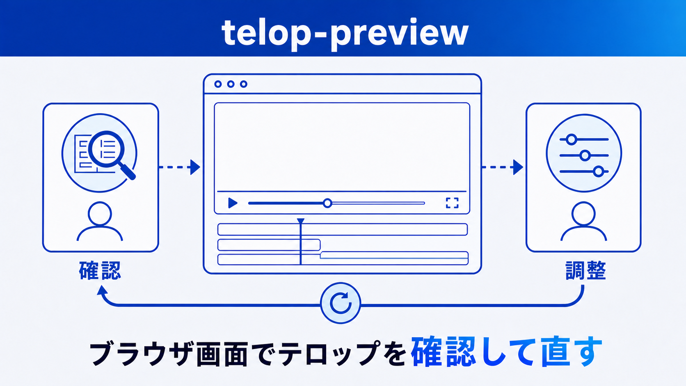

字幕をブラウザ画面で見ながら直せます。「音に合わせる」ボタンで全テロップを一括で音声に吸着、分割は無音位置に自動で寄ります。焼き込む前の最終確認用です。

> こんなとき: 「字幕を目で確認したい」「ここだけ直したい」

### 🔊 音声仕上げ

#### audio-master

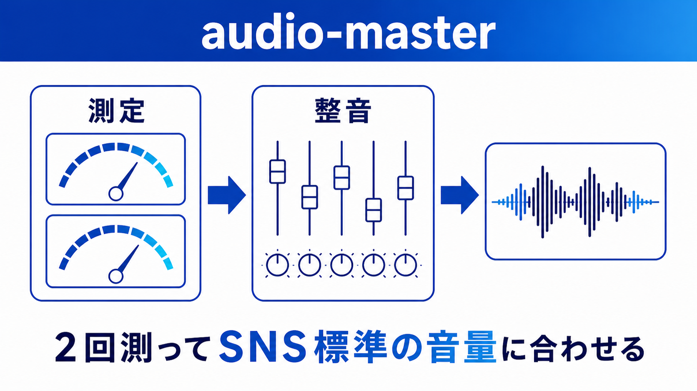

2回測ってから調整することで、素材の音量がバラついていても**SNS標準の音量に確実に揃えます**。軽いコンプとリミッターで音割れも防ぎます。

> こんなとき: 「音量がバラバラ」「小さくて聞こえない」

### 🚧 品質改札

#### qc-gate

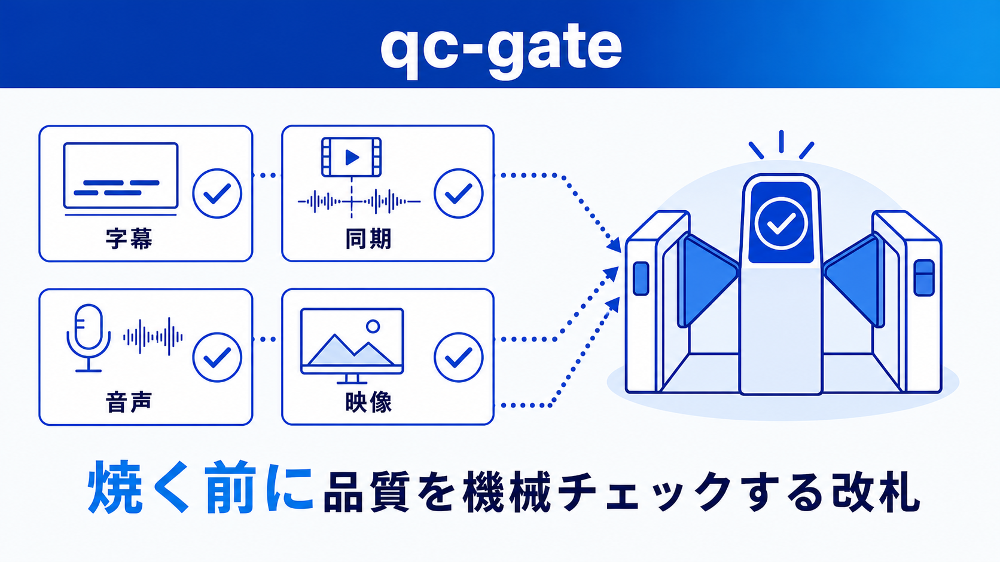

焼き込む前に必ず通す**チェック関門**です。字幕（字数・速度）、同期（テロップと発話のズレ）、音声（音量・ピーク）、映像（解像度・フレームレート）を機械的に検査します。

> こんなとき: 「焼く前に問題ないか確認して」

### 🔥 焼き込み（用途で3つに分岐）

#### render-horizontal-interview

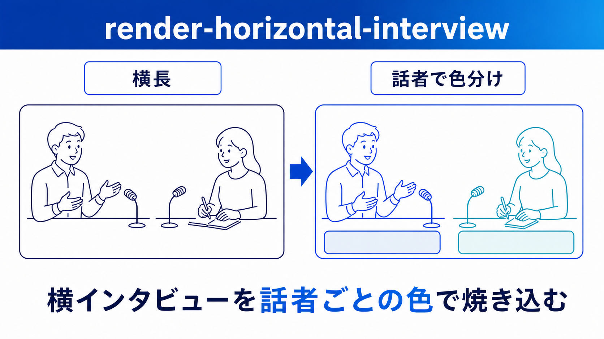

横長のインタビュー・対談動画を、**話者ごとに色を変えたフルテロップ**で焼き込みます。カット→整音→時刻の微調整→焼き込みまで一括で走ります。

> こんなとき: 「インタビュー動画を仕上げて」

#### render-vertical-reel

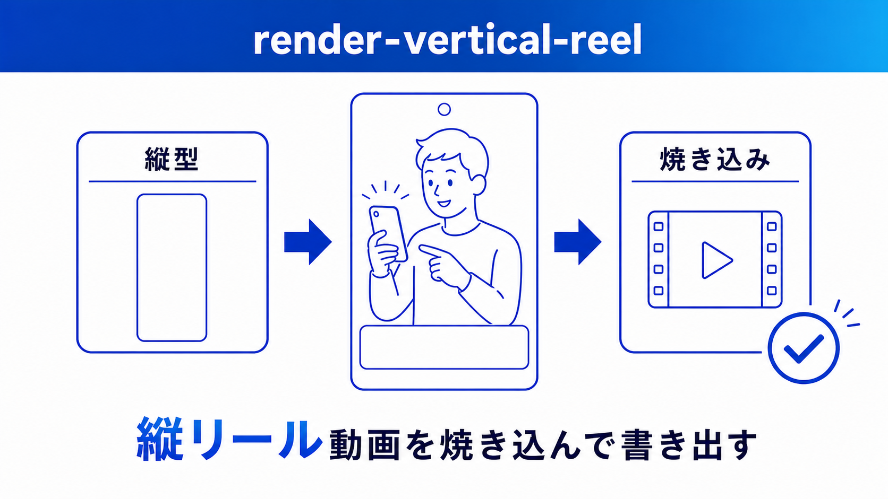

Instagram / TikTok 向けの**縦型リール**を焼き込みます。白テロップ＋影で、スマホの小さい画面でも読めます。

> こんなとき: 「リール用に縦で書き出して」

#### heading-overlay

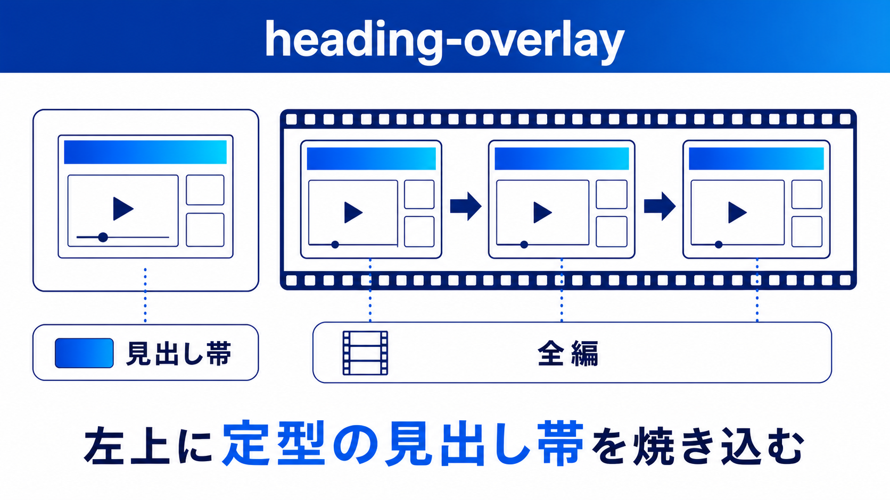

画面左上にKOU標準デザインの**見出し帯**（濃紺グラデ＋白文字）を全編に焼き込みます。デザインは固定なので、見出しの文字を渡すだけで毎回同じ見た目になります。完成済みの動画への後がけもできます。

> こんなとき: 「タイトルを入れて」「見出しつけて」

### 📦 納品

#### export-deliver

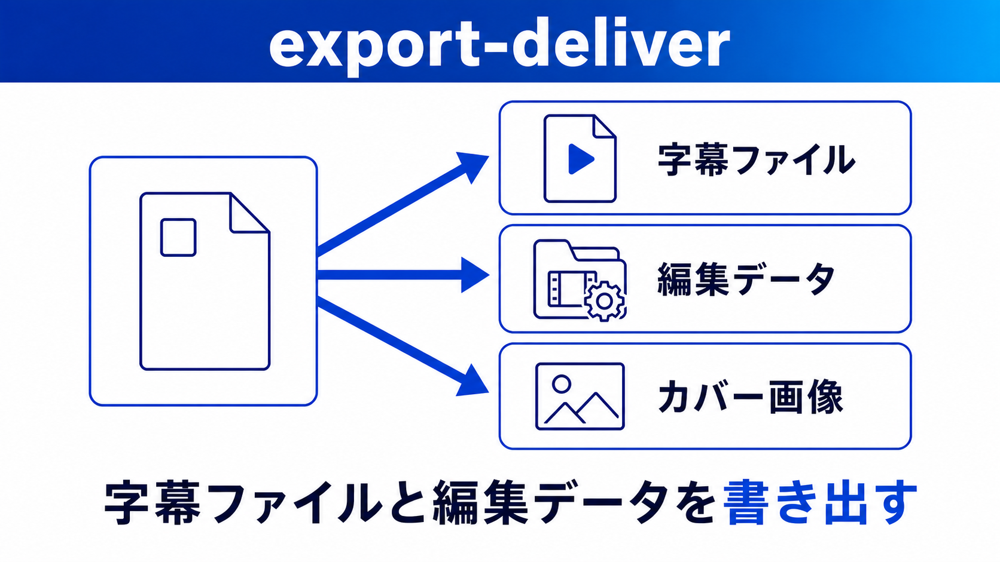

字幕ファイル（YouTube投稿用）・編集データ（編集ソフトで開く用）・カバー画像を書き出します。動画そのものの書き出しは上の焼き込み3種が担当します。

> こんなとき: 「字幕ファイルだけ欲しい」「編集ソフトに渡したい」

---

## 🔁 基本フロー（goal-align）

```
grill-me（認識合わせ・地図作成）
     ↓
  地図→4要素変換
     ↓
dod（完了定義を確定・ここで一旦停止）
     ↓（ユーザーが明示指示した場合のみ）
solution-research（軽量版・クイック5手法で解決策を探索・推奨）
     ※「深く・徹底的に」なら solution-deep-research（カタログ26型＋ペルソナ）
     ※木下式の固定4案が欲しいときは kinoshita-solution を単体起動

スライド制作は slide-message-architect（設計）→ blue-gradient-slide-generator（生成）
```

---

## 🔄 アップデート方法

- **MCPで使っている人（claude.ai / Desktop / Claude Code）**: **作業不要**です。サーバー側を更新すれば全員に自動で反映されます。
- **Codex の人**: `git -C kou-skills pull` → `bash kou-skills/install-codex.sh --update`（fulltelop-edit を使う人は `bash kou-skills/install-codex-fulltelop.sh --update` も実行。既存スキルを最新化し、シムリンク運用のものは触りません）

---

## 🛠 メンテナンス（管理者向け）

### スキルを追加・更新したとき

1. 正本（`~/.claude/skills` 側。一部は `recruit/skills` 配下の実体からのシムリンク）を更新する
2. 本リポの `plugins/<プラグイン名>/skills/` 配下へコピーし直す
3. **新規Skillでは必ず専用画像を1枚追加する**。`$blue-gradient-slide-generator`で1600×900以上の16:9 PNGを作り、次の未使用番号を使って`docs/images/skills/<NN>-<skill-name>.png`へ置き、READMEの対象Skill説明直下に掲載する
4. **MCPサーバーを再ビルド＆デプロイして配信内容を反映する**:

```bash
cd mcp-server
node build-skills.mjs      # 22スキルを src/skills-data.json に再バンドル
node test.mjs              # 14ケースの自動テスト（全Skillの専用画像チェックを含む）
npx wrangler deploy        # Cloudflare Workers へ反映
```

5. コミット・push する

> **絶対ルール:** Skill本体と専用画像は1対1です。画像がない、複数ある、壊れている、READMEの対応Skill欄に掲載されていない、16:9でない場合はローカルテストとGitHub Actionsが失敗します。

### MCPサーバーの構成

`mcp-server/` はランタイム依存パッケージ0のCloudflare Worker（Streamable HTTP・読み取り専用）です。

| ファイル | 役割 |
|---|---|
| `build-skills.mjs` | `plugins/*/skills/*/SKILL.md` とテキスト参照を走査して `src/skills-data.json` を生成（決定論的ビルド） |
| `src/index.js` | MCPサーバー本体。`/mcp` で JSON-RPC を処理し、3つのtoolsと22のpromptsを公開 |
| `test.mjs` | プロトコル適合＋全Skill専用画像ゲートの自動テスト14件 |
| `wrangler.jsonc` | デプロイ設定 |

配信するのはテキスト（SKILL.md＋references）のみで、画像・フォント・Pythonスクリプトは含めません（スクリプトを伴うスキルは、その旨の注記を本文先頭に付けて返します）。
